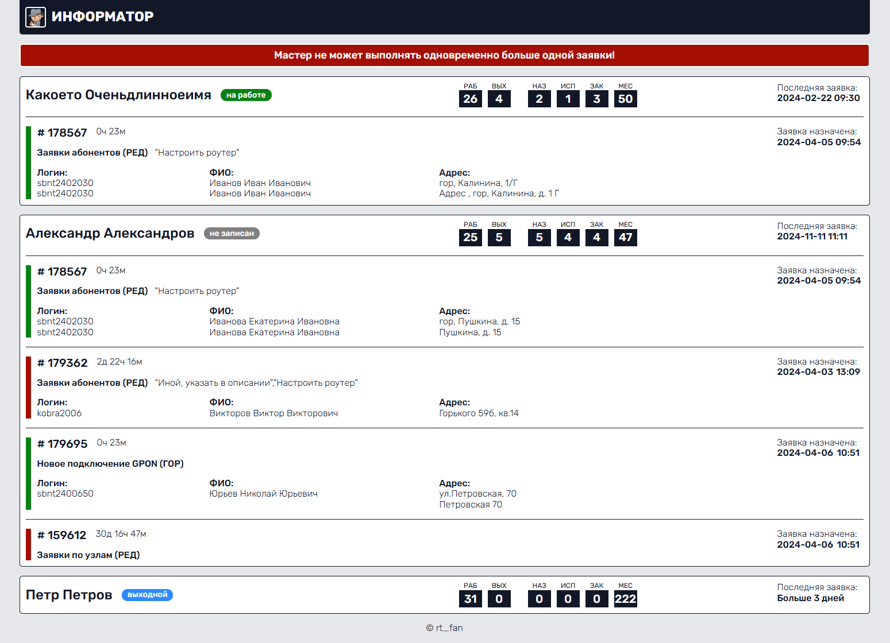

**Dashboard** - сервис для отображения списка работников с назначенными на них заявками и информации по ним.
Блок работника включает в себя следующую информацию:
- Имя работника
- Запись в табеле
- Количество отработанных дней в текущем месяце
- Количество выходных дней в текущем месяце
- Количество назначенных на мастера заявок
- Количество заявок в исполнении (в идеале не больше одной, но они не идеальны)
- Количество выполненных заявок за текущий день
- Количество выполненных заявок за текущий месяц
- Дата и время последней выполненой заявки

Если у работника есть заявки в исполнении, информация по ним отображается ниже, отдельным блоком, внутри блока работника.

